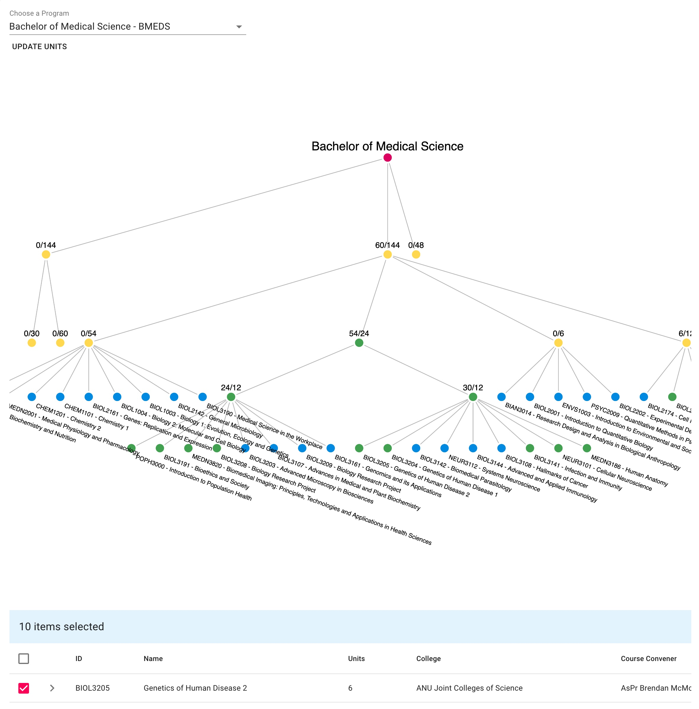
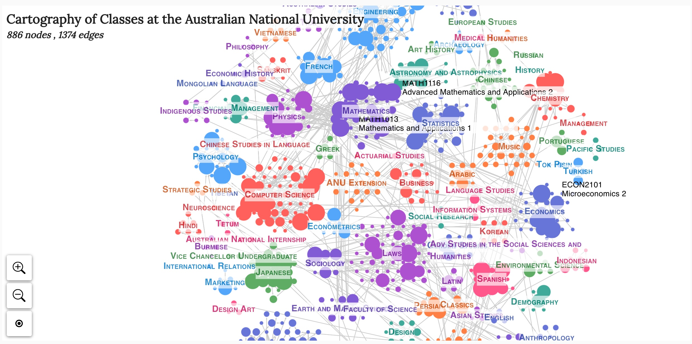

# ANU Programs & Courses Graph Explorer




## Quickstart


Install dependencies:

```
npm install
```

Start the development server:

```
npm start
```

This will serve the app on `http://localhost:3000`

---
To build with Docker,

```
docker build -t anu_graph_webapp .
docker container run --publish 3000:3000 --env-file .env anu_graph_webapp
```